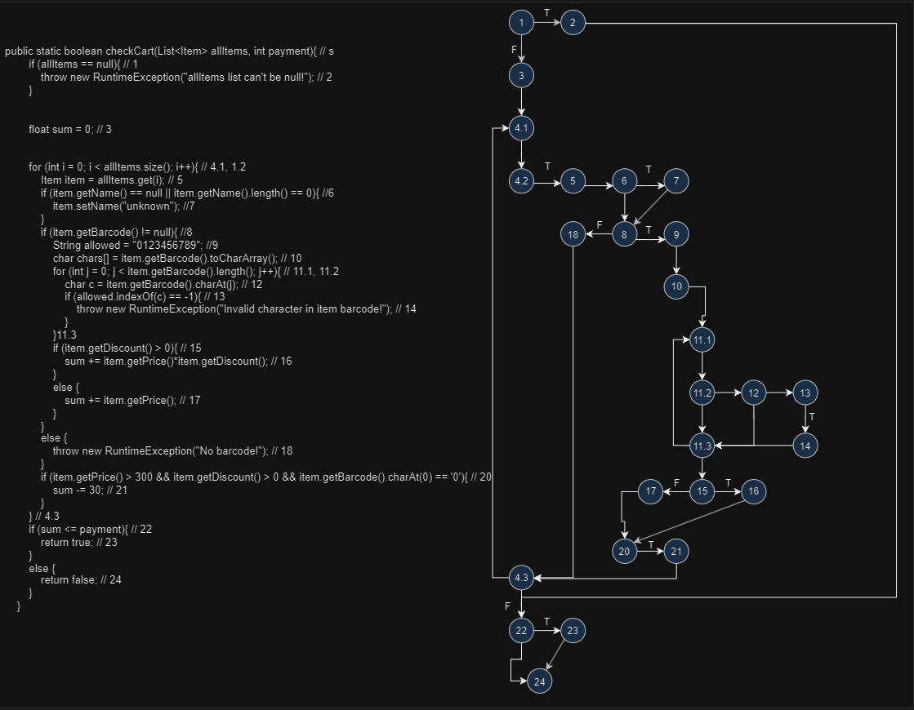
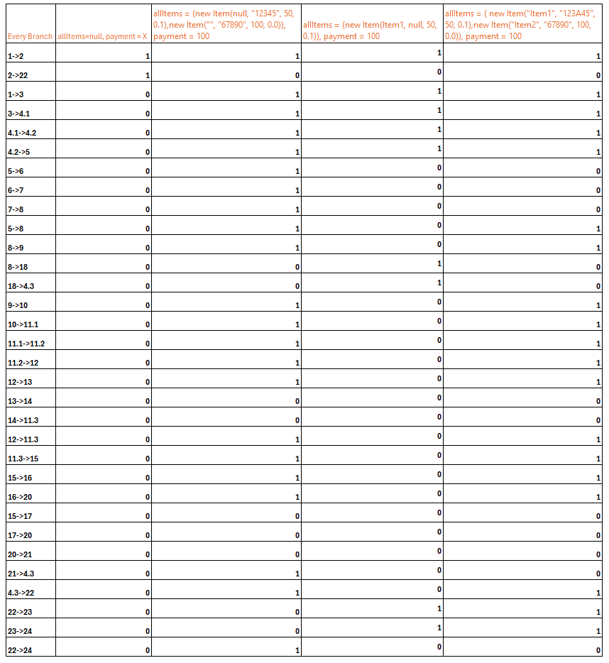

### Лабораториска вежба бр.2 Софтверско Инженерство
## Иван Ивановски 212093
### Одговор на прашања од вежба се подолу
### Control Flow Graph

###  Цикломатска комплексност
За да пресметаме цикломатската комплексност на дадената функција, треба прво да идентификуваме јазлите и ребрата во контролниот токовен граф (CFG) на функцијата.  
Потоа можеме да го примениме следниот израз за пресметување на цикломатската комплексност: 
V(G)=E−N+2 
Каде што: 
<ul>
<li>V(G) е цикломатската комплексност,</li>
<li>E е бројот на ребра (линии на кодот)</li>
<li>N е бројот на темиња (основни блокови или точки на одлука).</li> 
</ul>
Па според горе прикажаниот граф имаме 24 темиња, 32 ребра па од тука цикломатската комплексност ќе биде: V(G)=32-24+2=34-24=10.  
Значи графот има цикломатска комплексност 10.
### Тестирање според every branch критериум

